# Santiago Leal

<aside>

</aside>

> noUsoGitHub
> 
> 
> I'm a software dumb with a burning passion for learning and development. I specialize in Artificial Intelligence (AI) and Pokémon. Python, Tensorflow, Sk-learn, Pytorch, Numpy, Pandas, Spark, Keras, Seaborn, SQL are my best skills.
> But wait, there's more!
> 

Teamwork, innovation, and problem-solving are my jam, just like catching 'em all in Pokémon! But let's not forget my true love—my adorable doggos! 

They're my buddys as I conquer new challenges and technologies.
[**📨 Email Me →**](mailto:)

[**🤙 Call Me →**](tel:)

[**📝 My Resume →**](https://www.notion.so/templates/resume)
↓ Here is some of my work!

---

